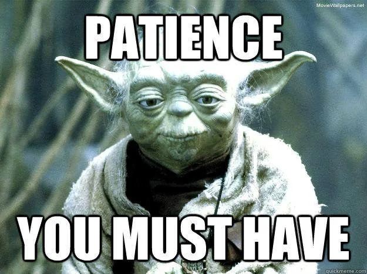

# Toy Generation and Confidence Level (CL) Evaluation

**Important Notes**

- Please pay attention not to use someone else's scratch-cbe directory.
  
Step 1: generate toys  
Step 2: fit the toys  
Step 3: plot
  
---

### Scripts

- `toys/generate_toys.py` — Generates toy datasets and stores indices.
- `toys/fit_toys.py` — Minimises the likelihood with the POIs and the nuissances floating.
- `toys/submit_toy_fits.py` — Batch submission for the toy fits.

### Toy generation

Generate toys based on a target PDF.

for CMS-sim:

`python3 toys/generate_toys.py configs/unbinned_v5/2016/unbinned_2016_6.yaml PDF4LHC21_mc --n-toys 10000`

for Delphes-sim:

`python3 toys/generate_toys.py configs/unbinned_v5D/unbinned_delphes_6_RunII.yaml PDF4LHC21_mc --n-toys 10000`

### Single toy fit (on the login node)
⚠
`export OMP_NUM_THREADS=1`  -> do it or you abuse the login-node. Also multicore doesn't speed up anything.

**⚠ Believe it or not, it takes about half an hour to start the toy generation.**

**After it starts generating, it goes faster.**

for CMS-sim:

`python3 -u toys/fit_toys.py configs/unbinned_v5/2016/unbinned_2016_6.yaml /scratch-cbe/users/$USER/SBIPDF/output/toys/toys_PDF4LHC21_mc_m0_rw_N10000.npz --toy-number 0 --rotate toys/rotation/eigen_basis_unbinned_2016_6_unbinned_2016_v5.json --print-every 1 --minuit-print-level 2 --out /scratch-cbe/users/alikaan.gueven/SBIPDF/output/toys/toys_nominal_N10000/toy_0`

for Delphes-sim:

`python3 -u toys/fit_toys.py configs/unbinned_v5D/unbinned_delphes_6_RunII.yaml /scratch-cbe/users/$USER/SBIPDF/output/toys/toys_PDF4LHC21_mc_m0_rw_N10000.npz --toy-number 0 --rotate toys/rotation/eigen_basis_binned_delphes_6_RunII_binned_delphes_RunII_v5D.json --print-every 1 --minuit-print-level 2 --out /scratch-cbe/users/$USER/SBIPDF/output/toys/toys_nominal_N10000/toy_0`

### Batch submission of the toy fits.
⚠
**Warning: Please modify the paths in this script to submit the fits on the correct toys.**  
`python3 toys/submit_toy_fits.py`
### Plotting the PDF band

`python3 toys/plot_pdf_band_from_toy_bestfits_v2.py --config configs/unbinned_v5D/unbinned_delphes_6_RunII.yaml   --fit-dir /scratch-cbe/users/alikaan.gueven/SBIPDF/output/toys/toys_PDF4LHC21_mc_m0_rw_N1000   --rotate /scratch-cbe/users/robert.schoefbeck/SBIPDF/output/eigen_basis_binned_delphes_6_RunII_binned_delphes_RunII_v5D.json   --Q 1.65`

### Plotting the toy distributions

`python3 user/kaan/plot_fit_results.py`